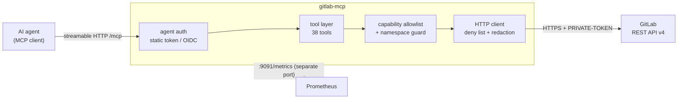

# Architecture

## The request path

Every tool call passes the same gates, in this order. The order matters: a call
that will be refused never produces a network request.

1. **Agent auth** — the middleware on `/mcp` verifies the caller's token.
2. **Instance resolution** — the named instance, or the configured default.
3. **Target resolution** — a project reference becomes a canonical full path.
   This happens even for a numeric id, so step 4 cannot be bypassed.
4. **Namespace guard** — the target must lie inside `allowedNamespaces`.
5. **Capability allowlist** — the tool's declared capability must be enabled,
   and write capabilities also pass the two `readOnly` kill switches.
6. **Deny list** — the path is checked against the unconditional block list.
7. **Rate-limit floor** — list traversals are refused when the remaining GitLab
   budget is below `minRemaining`, leaving headroom for single reads and
   pipeline operations.
8. **The request** — with `PRIVATE-TOKEN` injected by a RoundTripper that
   re-reads the token file each time, so rotation needs no restart.
9. **Redaction** — the response is rewritten before it reaches the tool layer.

See [permissions.md](permissions.md) for what each gate enforces.

## Packages

| Package | Responsibility |
|---|---|
| `internal/config` | load, default and validate the configuration; emit startup warnings |
| `internal/auth` | authenticate the agent (static tokens, OIDC, RFC 9728 metadata) |
| `internal/perm` | the capability enum, the guard, the namespace matcher |
| `internal/gitlab` | the typed REST client, deny list, redaction, pagination |
| `internal/instances` | per-instance HTTP clients, token injection, the registry |
| `internal/mcpserver` | tool registration, parameter plumbing, output formatting |
| `internal/metrics` | Prometheus metrics and the outbound RoundTripper |

## Design choices worth knowing

**Expected failures are tool errors, not transport errors.** A 403 from GitLab, a
denied capability or a namespace violation all come back as an MCP tool error
with the message intact, so the model can read and act on it.

**Tools are always registered.** A disabled capability returns an error naming
itself rather than vanishing from `tools/list`. "Why can't you do X?" should be
answerable.

**Listings always say when they were truncated.** A silently partial list reads
to a model as a complete one, which is worse than no list at all.

**The registry never contacts GitLab at startup.** An unreachable instance does
not prevent the server from starting; reachability is reported by
`instances_list` and by a background prober feeding `gmcp_instance_up`.

**Structs omit secret-bearing fields.** `Pipeline` has no `variables` field and
`PipelineSchedule` has no `variables` field, so even a decoding mistake has
nowhere to put one. That is a second barrier behind the deny list and redaction.

**One transport, no filesystem.** The server speaks streamable HTTP only and the
only files it opens are its own config and token files. There is no stdio mode
and no path-reading tool.
