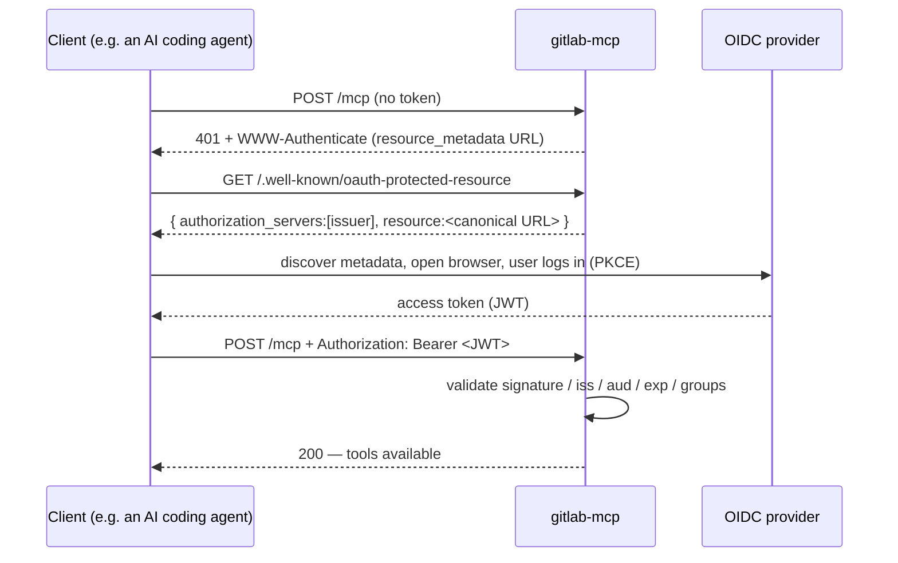

# Agent → MCP authentication

Two independent things are called "auth" around this server; keep them apart:

| | Decides | Mechanism |
|---|---|---|
| **Agent auth** (this document) | who may call the MCP at all | static bearer tokens and/or OIDC |
| **GitLab auth** ([token-setup.md](token-setup.md)) | what the MCP may do at GitLab | a personal access token |

Only `/mcp` is gated. `/healthz`, `/readyz` and
`/.well-known/oauth-protected-resource` stay open — probes must work without a
credential, and the metadata document is public by specification. Metrics live
on a **separate, unauthenticated port** and must never be exposed publicly.

## Mode 1 — static bearer tokens

For machine callers. Each token is a shared secret the client sends as
`Authorization: Bearer <token>`.

```yaml
auth:
  enabled: true
  static:
    enabled: true
    tokens:
      - name: ci
        tokenFile: /etc/gmcp/auth/ci/token
```

Prefer `tokenFile` over an inline `token`: files are re-read on **every**
verification, so rotating the secret needs no restart. Comparison is
constant-time.

## Mode 2 — OIDC

The MCP acts as an OAuth 2.1 **resource server**: it validates JWT access tokens
(signature via the provider's JWKS, plus issuer, audience and expiry) and
optionally enforces required scopes and groups. No client secret is needed — JWKS
is public.

```yaml
auth:
  enabled: true
  oidc:
    enabled: true
    issuer: "https://auth.example.com/application/o/gitlab-mcp/"
    audience: "gitlab-mcp"
    resource: "https://gitlab-mcp.example.com/mcp"
    groupsClaim: "groups"
    usernameClaim: "preferred_username"
    requiredGroups: []            # e.g. ["gitlab-mcp-users"]
    resourceMetadata: true
```

### `audience` and `resource` are different things

This trips people up, so it is worth being precise:

| Field | Who sets it | Value |
|---|---|---|
| **`audience`** | the authorization server, stamped into the token's `aud`; the MCP validates it | often the OIDC **client id** — an opaque string, not a URI |
| **`resource`** | this server, published in its own RFC 9728 metadata; clients echo it as the RFC 8707 `resource` parameter when requesting a token | the MCP's **canonical public URL** |

Conflating them breaks the binding that lets a client request a token scoped to
*this* server. Without it, a token minted for one MCP can be replayed against
another that happens to share an audience string.

So **`resource` is effectively required**: when `resourceMetadata` is true, the
server validates that the effective identifier is an absolute `https` URI with a
host and no fragment, and refuses to start otherwise. It falls back to `audience`
only for installations whose audience already *is* a URL.

### Login flow (first use only)



### Provider without Dynamic Client Registration

Some providers (Authentik, for example) do not support DCR, so the client must be
given the pre-registered `client_id` **and** the provider's metadata URL:

```json
{ "mcpServers": { "gitlab": {
  "type": "http",
  "url": "https://gitlab-mcp.example.com/mcp",
  "oauth": {
    "clientId": "gitlab-mcp",
    "authServerMetadataUrl": "https://auth.example.com/application/o/gitlab-mcp/.well-known/openid-configuration"
  }
}}}
```

Register the localhost redirect URIs the agent will use
(`http://localhost:\d+/.*`, `http://127.0.0.1:\d+/.*`), make the client public
with PKCE, and include claims in the access token. Add a `groups` scope mapping
if you use `requiredGroups`.

### Provider with DCR

With a DCR-capable provider (Keycloak, for example) the client self-registers, so
only the URL is needed in the agent config. Add an audience mapper so `aud`
matches `oidc.audience`, and configure `oidc.resource` independently as the
public MCP URL.

## Both at once

Enable `static` and `oidc` together: machines present a static token, humans get
the browser flow. A request is accepted if **either** verifier accepts it.
`gmcp_auth_requests_total{method,result}` records which one allowed or denied it.

## Running without auth

`auth.enabled: false` leaves the transport open and emits a startup warning. It
is only acceptable behind something else that authenticates — an internal-only
ingress, a service mesh, or a local port. Never expose it publicly.

When auth *is* enabled, run it behind TLS: a bearer token over plaintext is no
protection at all.
